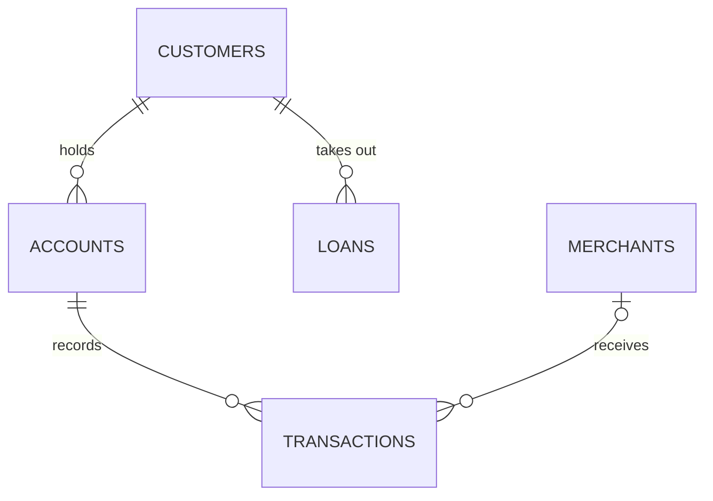

# Source system ERD (core_banking)

```mermaid
erDiagram
    CUSTOMERS ||--o{ ACCOUNTS : holds
    CUSTOMERS ||--o{ LOANS : "takes out"
    ACCOUNTS ||--o{ TRANSACTIONS : records
    MERCHANTS |o--o{ TRANSACTIONS : receives
```